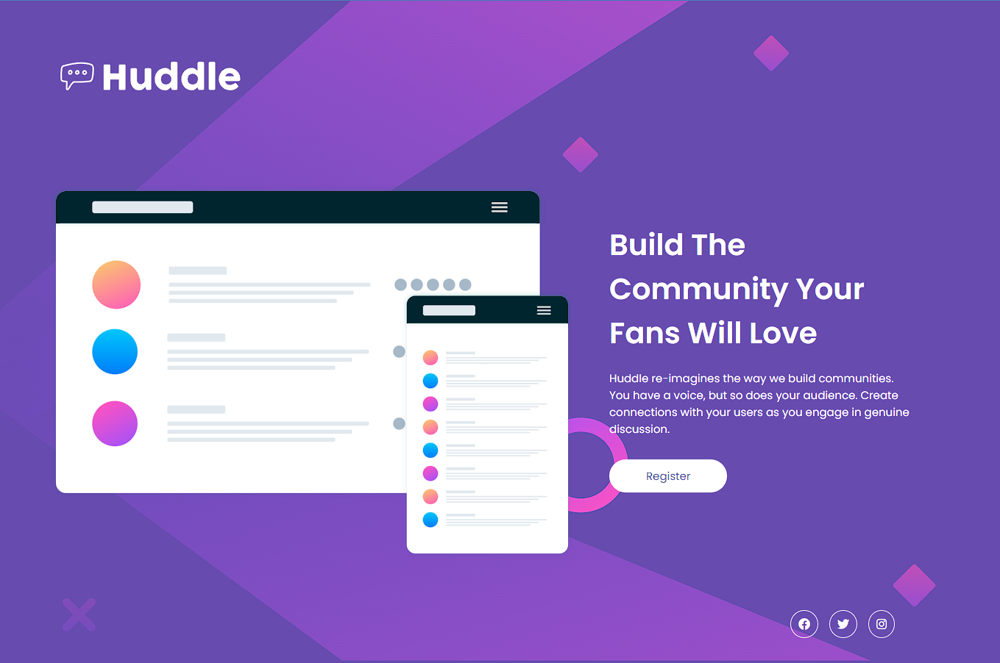

# Frontend Mentor - Huddle landing page with single introductory section solution

### The challenge

Users should be able to:

- View the optimal layout for the page depending on their device's screen size
- See hover states for all interactive elements on the page

### Screenshot

### Links

- Solution URL: [Solution URL](https://your-solution-url.com)
- Live Site URL: [Site URL](https://your-live-site-url.com)

## My process

### Built with

- Semantic HTML5 markup
- CSS custom properties
- Displey flex
- Flexbox
- Mobile-first workflow

## Author

- Website - [Júlio Resende Dev](https://github.com/julioresende77)
- Frontend Mentor - [@julioresende77](https://www.frontendmentor.io/profile/julioresende77)
- Twitter - [@ResendeDev](https://twitter.com/ResendeDev)